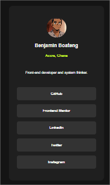

# Frontend Mentor - Social links profile solution

This is a solution to the [Social links profile challenge on Frontend Mentor](https://www.frontendmentor.io/challenges/social-links-profile-UG32l9m6dQ). Frontend Mentor challenges help you improve your coding skills by building realistic projects. 

## Table of contents

- [Overview](#overview)
  - [The challenge](#the-challenge)
  - [Screenshot](#screenshot)
  - [Links](#links)
- [My process](#my-process)
  - [Built with](#built-with)
  - [What I learned](#what-i-learned)
 
- [Author](#author)

## Overview

### The challenge

Users should be able to:

- See hover and focus states for all interactive elements on the page

### Screenshot

### Links

- Solution URL: [Add solution URL here](https://github.com/Bensolve/social-links-profile-main)
- Live Site URL: [Add live site URL here](https://social-links-profile-main-solution.netlify.app/)

## My process

### Built with

- Semantic HTML5 markup
- CSS custom properties
- Flexbox
- Mobile-first workflow

### What I learned

I learnt that hover and focus are used to make interactive element more accessible.
when we say interactive elements we are trying to say an elemrnt that does something or go somewhere for eg: a button element will do something and anchor elment will open into a new content on a different page .

## Author

- Frontend Mentor - [@yourusername](https://www.frontendmentor.io/profile/Bensolve)
- Twitter - [@yourusername](https://x.com/Benjaminkissa1)

*

